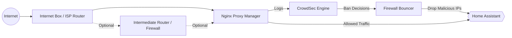

# homeassistant-crowdsec

Configurations et règles de sécurité pour exposer Home Assistant sur Internet de manière sécurisée avec Nginx Proxy Manager et CrowdSec.

## Architecture

## nginx
### Installation nginx
Pour installer nginx : https://github.com/hassio-addons/addon-nginx-proxy-manager

### Configuration du proxy
A paramétrer dans la partie "Advanced" du proxy nginx

## crowdsec

### Installation crowdsec
Deux modules à installer :
- Crowdsec pour détecter : https://github.com/crowdsecurity/home-assistant-addons/blob/main/crowdsec/DOCS.md
- Crowdsec Firewall Bouncer pour appliquer automatiquement des bans : https://github.com/crowdsecurity/home-assistant-addons/blob/main/crowdsec-firewall-bouncer/DOCS.md

### scenarios personnalisés 
Les scenarios sont à déposer sur :
- /config/.storage/crowdsec/config/scenarios

### configuration homeassistant pour creer des sensors
- Configuration des "sensor" dans le répertoire homeassistant/ à ajouter dans le configuration.yaml

### configuration homeassistant pour creer des dashboards de suivi
- Configuration d'un board de suivi à créer sur les (http://homeassistant.local:8123/config/lovelace/dashboards)

### Commandes utiles
- cscli metrics
- cscli alerts list
- cscli decisions list
- cscli scenarios list

## Features

- Nginx Proxy Manager hardening
- CrowdSec integration
- Firewall Bouncer automatic bans
- Custom aggressive probing detection
- Home Assistant security dashboard
- Real-time intrusion monitoring

## Disclaimer

This project is provided as-is and should be adapted to your own infrastructure and security requirements.
