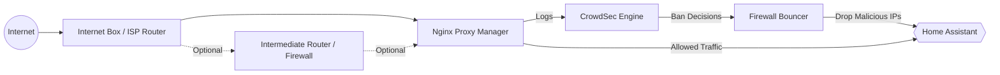

# homeassistant-crowdsec

Configurations et règles de sécurité pour exposer Home Assistant sur Internet de manière sécurisée avec Nginx Proxy Manager et CrowdSec.

## Architecture



## nginx
### Installation nginx
Pour installer nginx : https://github.com/hassio-addons/addon-nginx-proxy-manager

### Configuration du proxy
A paramétrer dans la partie "Advanced" du proxy nginx

## crowdsec
Deux modules à installer :
- Crowdsec pour détecter
- Crowdsec Firewall Bouncer pour bannir les IP

### Installation crowdsec

- Documentation Crowdsec : https://github.com/crowdsecurity/home-assistant-addons/blob/main/crowdsec/DOCS.md

Paramétrage à personnaliser :

- Modifier la configuration en vue YAML : 
```yaml
acquisition: |
  --- 
  source: journalctl

  journalctl_filter: 
    - "--directory=/var/log/journal/"
  labels:
    type: syslog

  --- 
  source: journalctl

  journalctl_filter: 
    - "--directory=/var/log/journal/"
  labels:
    type: nginx
  transform:
  "ReplaceAll(evt.Line.Raw,'addon_a0d7b954_nginxproxymanager','nginx')"
disable_lapi: false
remote_lapi_url: ""
agent_username: ""
agent_password: ""
collections:
  - crowdsecurity/home-assistant
  - crowdsecurity/nginx
  - crowdsecurity/nginx-proxy-manager
parsers: []
scenarios: []
postoverflows: []
parsers_to_disable: []
scenarios_to_disable: []
disable_online_api: false
```

### Installation de Crowdsec Firewall Bouncer
- **Crowdsec Firewall Bouncer** pour appliquer automatiquement des bans : https://github.com/crowdsecurity/home-assistant-addons/blob/main/crowdsec-firewall-bouncer/DOCS.md

Récupérer le nom du host sur le module Crowdsec (Nom d'hôte : XXXXX-crowdsec)
- Paramétrer l'URL : http://XXXXX-crowdsec:8080/

Pour la clef d'API, CF la documentation **Crowdsec Firewall Bouncer**

### Configuration des remediations
Le fichier de profiles.yaml doit être déposé ici :
- /config/.storage/crowdsec/config

### scenarios personnalisés 
Les scenarios sont à déposer sur :
- /config/.storage/crowdsec/config/scenarios

### configuration homeassistant pour creer des sensors
- Configuration des "sensor" dans le répertoire homeassistant/ à ajouter dans le configuration.yaml

### configuration homeassistant pour creer des dashboards de suivi
- Configuration d'un board de suivi à créer sur les (http://homeassistant.local:8123/config/lovelace/dashboards)

### Commandes utiles
- cscli metrics
- cscli alerts list
- cscli decisions list
- cscli scenarios list

## Features

- Nginx Proxy Manager hardening
- CrowdSec integration
- Firewall Bouncer automatic bans
- Custom aggressive probing detection
- Home Assistant security dashboard
- Real-time intrusion monitoring

## Disclaimer

This project is provided as-is and should be adapted to your own infrastructure and security requirements.
